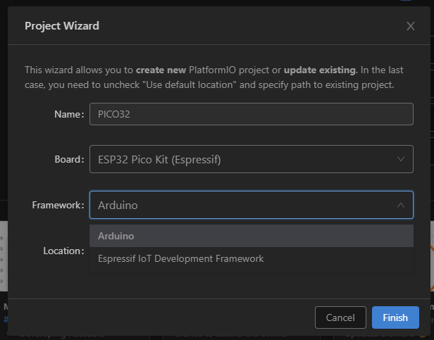

# Flashing Pico32

To program & flash Pico32, you can use supercool extension for [VSCode](https://code.visualstudio.com/) named [PlatformIO](https://platformio.org/). **I will not describe how to install or use PlatformIO, there are plenty tutorials online**.

When you creating new project, for the board select `ESP32 Pico Kit (Espressif)` as the board. You can then use both frameworks. For pins & other information, use [esp32-pico-d4 datasheet](https://www.espressif.com/sites/default/files/documentation/esp32-pico-d4_datasheet_en.pdf).

If you want to flash the program, connect you USB to UART converter to the board, and **IO0 to GND**, this must be done before you power the board(or reset it) so the esp32-pico-d4 will boot to flashing mode. After finished flashing you have to reset/repower the board without IO0 grounded to start the program. Full explonation of the boot flow & flashing mode is [here](https://github.com/espressif/esptool/wiki/ESP32-Boot-Mode-Selection).